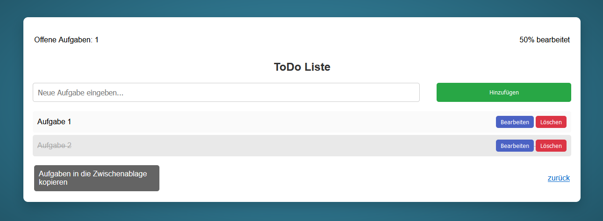

<a href="http://mdrolshagen.github.io" target="_blank">Hier</a> geht's zur Website

## ToDo-Liste

Aufgaben werden im localstorage der Browsers gespeicher. Sie bleiben nach Neuladen der Seite oder nach einem Neustart des Browsers bestehen.

Der "Bearbeiten" Button wird in Zukunft funktionieren.
